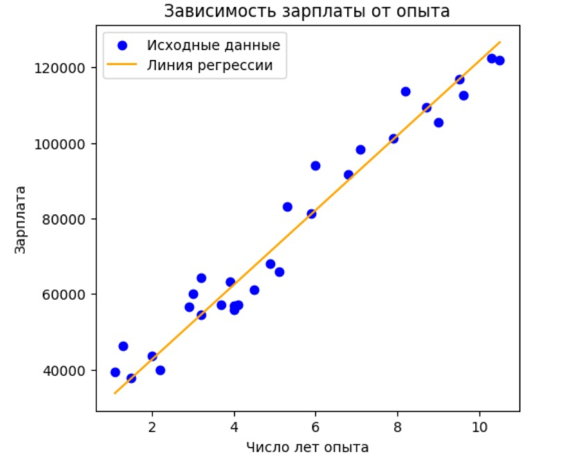

# ML_2ndSemester_HW1  Salary & Experience (Linear Regression, Gradient Descent)

# Анализ данных: Зависимость зарплаты от опыта работы с помощью линейной регрессии 📈

## Введение
В этом проекте мы исследуем, как опыт работы влияет на зарплату, используя **линейную регрессию**, написанную с нуля на Python. Данные загружены из файла `salary_data.csv`, а модель обучена с помощью градиентного спуска. Результаты представлены с визуализацией для наглядности. Давайте разберем, что получилось! 🚀

---

## Основные выводы
1. **Модель линейной регрессии** отлично справилась с задачей:  
   - Обученные параметры: вес ≈ 9876.11, смещение ≈ 22920.49.  
   - Линейная зависимость между опытом и зарплатой подтверждена! 🎉

2. **Класс `LinearRegression`** реализован полностью:  
   - `__init__`: настройка параметров.  
   - `fit`: обучение модели.  
   - `predict`: предсказание зарплаты.  

3. **Обучение прошло успешно**:  
   - Использовано 30 записей (опыт: 1.1–10.5 лет, зарплата: 37731–122391).  
   - 1000 итераций градиентного спуска с нулевыми начальными параметрами.  

4. **Визуализация**:  
   - График показывает, как линия регрессии идеально ложится на данные. 📊  
   - Зарплата растет с опытом — всё как и ожидалось

5. **Качество кода**:  
   - Чистый, читаемый код с комментариями и в соответствии с PEP 8. 🧑‍💻  

---

### 1. Модель линейной регрессии
- **Зачем?** Показать линейную связь между опытом и зарплатой.  
- **Как?** Градиентный спуск нашел лучшие параметры:  
  - Вес ≈ 9876.11, смещение ≈ 22920.49.  
- **Результат**: Модель сошлась и работает

  

---

### 2. Реализация класса `LinearRegression`
- **Что внутри?**  
  - `__init__`: задает скорость обучения и итерации.  
  - `fit`: обновляет веса и смещение.  
  - `predict`: считает `Y_pred = X * weights + bias`.  
- **Итог**: Всё работает как надо! 💯  

---

### 3. Обучение модели
- **Данные**: 30 строк из `salary_data.csv`.  
- **Процесс**: Начали с нуля, обновляли параметры 1000 раз.  
- **Вывод**: Модель адаптировалась к данным 📈  

---

### 4. Визуализация результатов
- **Что видно?** Точки данных и линия регрессии совпадают.  
- **Вывод**: Зарплата растет линейно с опытом — гипотеза подтверждена 📊  

---

### 5. Качество кода
- **Структура**: Логично и понятно.  
- **Читаемость**: Хорошие имена переменных (`X`, `Y`, `weights`) и комментарии на русском.  
- **Стандарты**: Следуем PEP 8 🍬  

---

## Заключение
- **Что удалось?** Модель точно предсказывает зарплату по опыту.  
- **Зачем это нужно?** Для HR-анализа или планирования карьеры. 🚀  
- **Итог**: Есть модель, предсказывающая зарплату в соответствии с опытом работы

